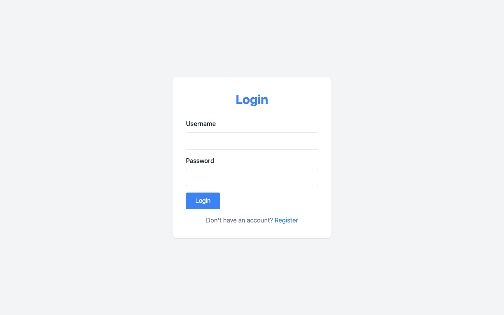
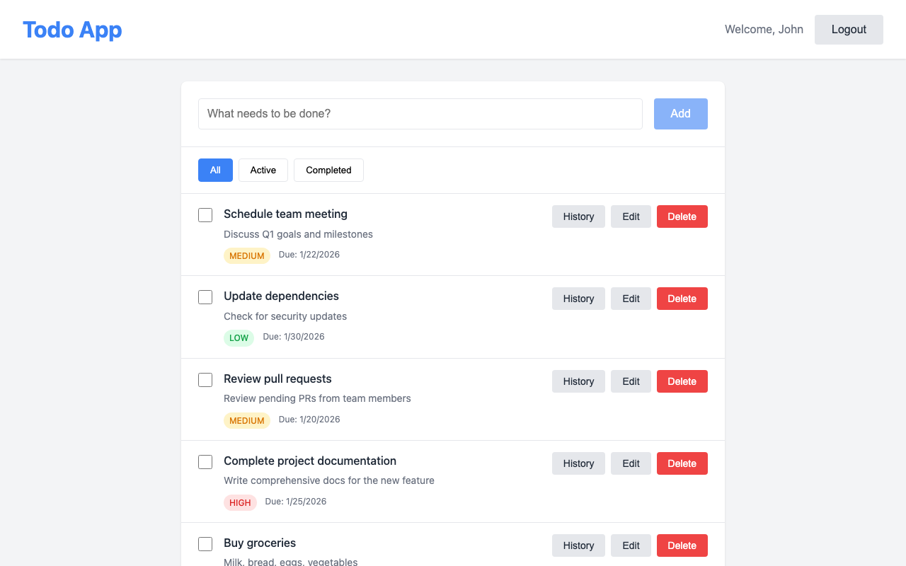
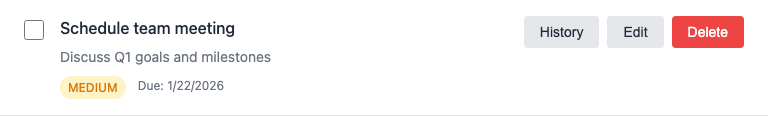
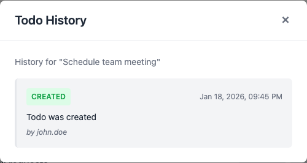
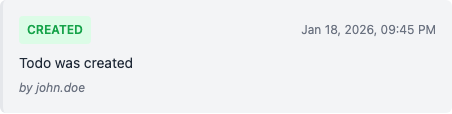
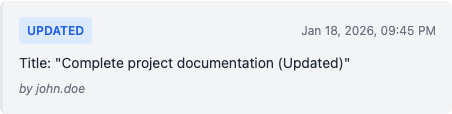
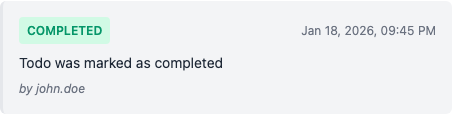
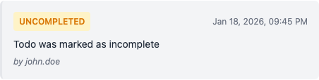
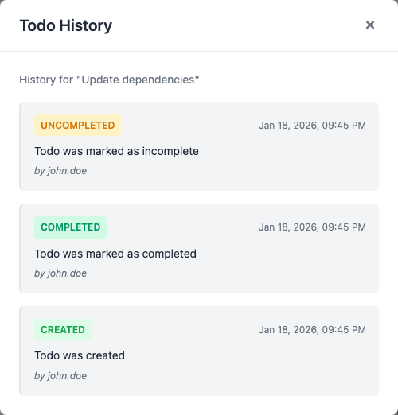

# Todo History Feature - User Guide

## Overview

The **Todo History** feature allows you to track all changes made to your todo items. Every action—creating, editing, completing, or uncompleting a todo—is automatically recorded with a timestamp and the user who made the change.

This guide walks you through how to access and use the History feature.

---

## Prerequisites

Before using the History feature, you must be logged into the Todo App.

### Step 1: Log In

1. Navigate to the login page
2. Enter your username and password
3. Click the **Login** button

*Figure 1: The login page where you enter your credentials*

---

## Accessing the Todo List

After logging in, you will see the main todo list view. This displays all your tasks with their details including:

- **Title** - The name of the task
- **Description** - Additional details about the task
- **Priority** - LOW (green), MEDIUM (yellow), or HIGH (red)
- **Due Date** - When the task is due
- **Action Buttons** - History, Edit, and Delete

*Figure 2: The main todo list showing all your tasks*

---

## Viewing Todo History

### Step 2: Locate the History Button

Each todo item has a **History** button on the right side, next to the Edit and Delete buttons.

*Figure 3: A single todo item showing the History button*

### Step 3: Click the History Button

Click the **History** button on any todo item to open the History modal.

### Step 4: Review the History Modal

The History modal displays all recorded changes for that specific todo, showing:

- **Action Badge** - Color-coded label indicating the type of change
- **Timestamp** - When the action occurred
- **Description** - What happened
- **User** - Who made the change

*Figure 4: The History modal showing the audit trail for a todo*

### Step 5: Close the Modal

Click the **X** button in the top-right corner of the modal, or click outside the modal to close it.

---

## Understanding History Entry Types

The History feature tracks five types of actions, each with a distinct color-coded badge:

### CREATED (Green)

Recorded when a new todo is added to your list.

*Figure 5: A CREATED history entry showing when the todo was first added*

**What's captured:**
- Initial title
- Initial description
- Initial priority
- Initial due date

---

### UPDATED (Blue)

Recorded when you modify any field of an existing todo.

*Figure 6: An UPDATED history entry showing the new title after editing*

**Triggers:**
- Changing the title
- Editing the description
- Modifying the priority
- Updating the due date

---

### COMPLETED (Green/Teal)

Recorded when you check the checkbox to mark a todo as done.

*Figure 7: A COMPLETED history entry*

**What happens:**
- Todo moves to completed state
- Checkbox appears checked
- Todo appears in the "Completed" filter

---

### UNCOMPLETED (Orange)

Recorded when you uncheck a completed todo to make it active again.

*Figure 8: An UNCOMPLETED history entry*

**What happens:**
- Todo returns to active state
- Checkbox is unchecked
- Todo appears in the "Active" filter

---

## Full History Example

When a todo has multiple changes, the History modal shows all entries in chronological order (newest first):

*Figure 9: A complete history showing multiple actions on a single todo*

In this example, you can see:
1. The todo was **CREATED**
2. It was later marked as **COMPLETED**
3. Then it was **UNCOMPLETED** (marked incomplete again)

---

## Quick Reference

| Action | Badge Color | When It Happens |
|--------|-------------|-----------------|
| CREATED | Green | New todo added |
| UPDATED | Blue | Any field changed |
| COMPLETED | Green/Teal | Checkbox checked |
| UNCOMPLETED | Orange | Checkbox unchecked |
| DELETED | Red | Todo removed |

---

## Frequently Asked Questions

### Can I undo changes using history?

No. The History feature is for **viewing** past changes only. It does not support restoring previous versions.

### Who can see my todo history?

Only you can see the history of your own todos. History is private to each user.

### Can I delete history entries?

No. History entries are **immutable** and cannot be deleted or modified. This ensures a complete audit trail.

### How long is history kept?

History is kept **indefinitely**. There is no automatic cleanup.

---

## Summary

The Todo History feature provides complete transparency into how your todos have changed over time. To use it:

1. **Log in** to the Todo App
2. **Find** the todo you want to inspect
3. **Click** the History button
4. **Review** the chronological list of changes
5. **Close** the modal when done

Every change is automatically tracked—no action required on your part.

---

*Document Version: 1.0*
*Last Updated: January 2026*
